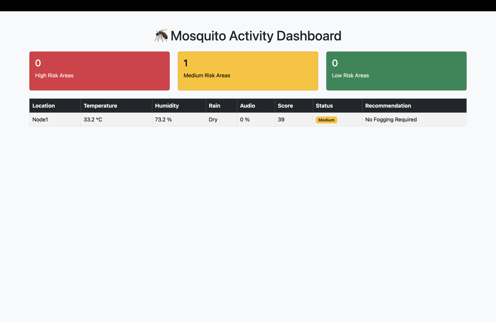
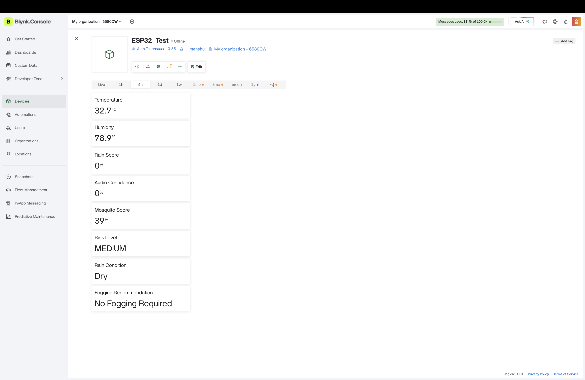
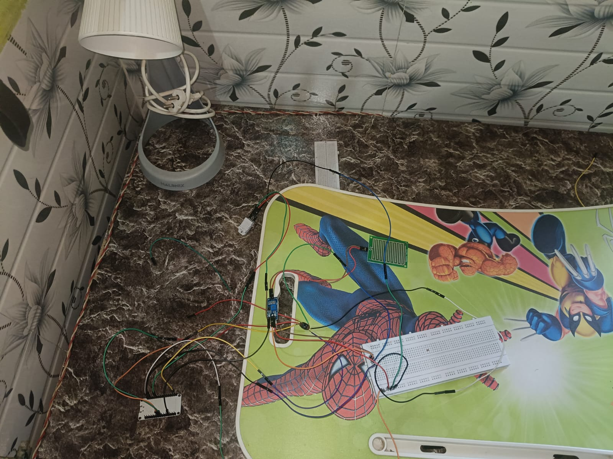

<h1 align="center">

🦟 Smart Mosquito Mapping and Intelligent Fogging Decision Support System using IoT

</h1>

<p align="center">

Real-Time IoT Monitoring • Firebase • Flask • ESP32 • Blynk

</p>
<p align="center">


</p>

A real-time IoT-based mosquito surveillance system that monitors environmental conditions, estimates mosquito activity, predicts mosquito risk, and recommends fogging actions using ESP32, Firebase, Flask and Blynk.

---

## 🌐 Live Demo

👉 **Dashboard:** https://mosquito-dashboard.onrender.com/

The dashboard updates automatically every **3 seconds** using data stored in Firebase.

# 📸 Dashboard Preview

<p align="center">

</p>

---
## 🚀 Key Highlights

- 📡 Real-time IoT Monitoring
- 🌡 Live Temperature & Humidity
- 🌧 Rain Detection
- 🎤 Mosquito Audio Confidence
- ☁ Firebase Realtime Database
- 🌐 Live Flask Dashboard
- 📱 Blynk Mobile App
- 🔄 Auto Refresh Every 3 Seconds
- 🚨 Intelligent Fogging Recommendation

## 🔄 Project Workflow

ESP32 Sensors

⬇

Data Processing

⬇

Firebase Realtime Database

⬇

Flask Backend

⬇

Live Dashboard

⬇

Fogging Recommendation

# 📖 Project Overview

Mosquito-borne diseases such as Dengue, Malaria and Chikungunya continue to threaten public health.

This project uses an ESP32-based IoT node to continuously monitor environmental conditions favorable for mosquito breeding.

Collected sensor data is uploaded to Firebase in real time. A Flask web application retrieves this data and displays a live dashboard showing mosquito activity levels and fogging recommendations.

The system provides an intelligent and low-cost solution for monitoring mosquito-prone areas.

---

# ✨ Features

- 🌡 Real-time Temperature Monitoring
- 💧 Humidity Monitoring
- 🌧 Rain Detection
- 🎤 Mosquito Audio Detection
- 📡 ESP32 IoT Node
- ☁ Firebase Realtime Database
- 🌐 Live Flask Dashboard
- 📱 Blynk Mobile Monitoring
- 🔄 Auto Refresh Dashboard
- 🚨 Fogging Recommendation System
- 📊 Mosquito Risk Classification

---

# 📱 Blynk Mobile Dashboard

<p align="center">

</p>

---

# 🔌 Hardware Prototype

<p align="center">

</p>

---

# 🏗 System Architecture

<p align="center">

</p>

---

# ⚙ Hardware Components

- ESP32 Development Board
- DHT22 Temperature & Humidity Sensor
- Rain Sensor Module
- INMP441 MEMS Microphone
- Breadboard
- Jumper Wires
- USB Power Supply

---

# 💻 Software Stack

- Python
- Flask
- Firebase Realtime Database
- ESP32 Arduino Framework
- Bootstrap 5
- Blynk IoT
- HTML
- CSS
- Render
- GitHub

---

## 📊 Project Status

✅ ESP32 Firmware Completed

✅ Firebase Integration Completed

✅ Flask Dashboard Completed

✅ Render Deployment Completed

✅ GitHub Repository Completed

🔄 Future Updates Planned

# 📂 Project Structure

```
Mosquito-Mapping
│
├── assets
├── templates
├── static
├── app.py
├── requirements.txt
├── README.md
└── .gitignore
```

---

# 🚀 Working Flow

1. ESP32 collects sensor readings.
2. Sensor values are processed.
3. Mosquito Activity Score is calculated.
4. Data is uploaded to Firebase.
5. Flask retrieves live data.
6. Dashboard refreshes automatically every 3 seconds.
7. Users receive mosquito risk and fogging recommendations.

---

# 📈 Future Improvements

- 📊 Historical Data Visualization
- 📍 GPS Location Mapping
- 🤖 AI-Based Mosquito Species Detection
- ☁ Weather API Integration
- 📧 SMS & Email Alerts
- 🗺 Heatmap Visualization
- 🔔 Push Notifications

---

## 👨‍💻 Developed By

**Himanshu**

IoT & Smart Healthcare Internship

Graphic Era Deemed to be University

Department of Computer Science & Engineering

# ⭐ If you like this project

Please consider giving this repository a ⭐ on GitHub.